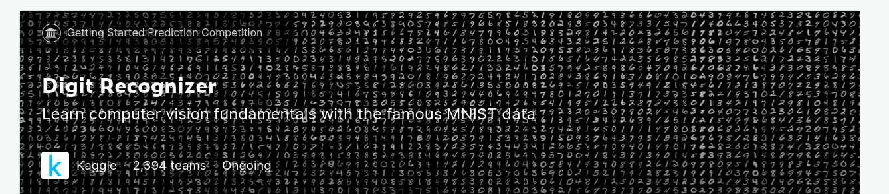

# Digit-Recognizer
This is a toy problem. To get basic understanding to the image and cnn model concepts. Implemented it to do various experiments. MNIST ("Modified National Institute of Standards and Technology") is  the de facto “hello world” dataset of computer vision. Since its release in 1999, this classic dataset of handwritten images has served as the  basis for benchmarking classification algorithms. As new machine  learning techniques emerge, MNIST remains a reliable resource for  researchers and learners alike. The goal is to correctly identify digits from a dataset of tens of thousands of handwritten images. 

